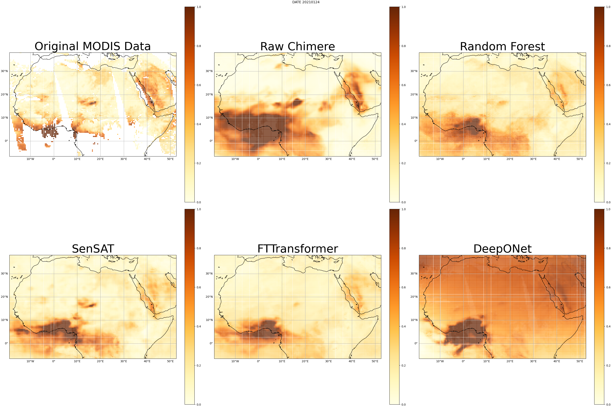

# SSAT: From Sensor data to Satellite Imaginary with Auto-Correlation Transformer for Enhanced AOD Regression Prediction

 

## 📌News

[2024.11.21] - 🧨After tried 23 models and 1200+ experiments, we got milestone result.  
[2024.07.21] - Begin based on work of https://www.mdpi.com/2184536 .  

## ⏰TODOs
- [ ] Release the model and inference code
- [x] Provide publicly accessible result
- [ ] Provide samples of result
- [ ] Release tools for merging weights from community models or LoRAs
- [ ] Release SSAT-benchmark evaluation code
- [ ] Release SSAT training code
 

## 💡Methodology
SSAT is a novel architecture that integrates the strengths of FT-Transformer and Autoformer to enhance the prediction of Aerosol Optical Depth (AOD) from satellite data. This hybrid approach merges the effective representation learning capability of transformers with Autoformer's advanced temporal decomposition techniques, providing significant improvements in predictive accuracy, stability, and computational efficiency. Below, we describe the key components of SSAT, supported by mathematical formulations to elucidate the underlying mechanisms.

