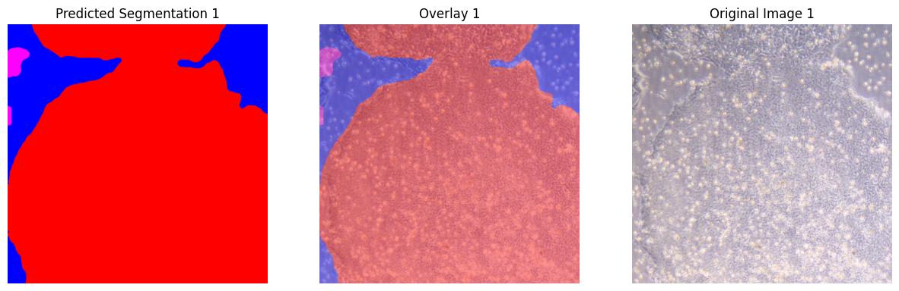
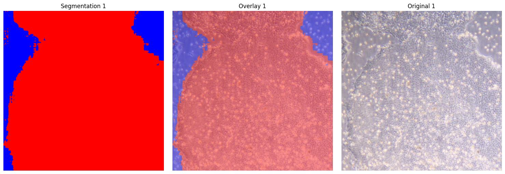
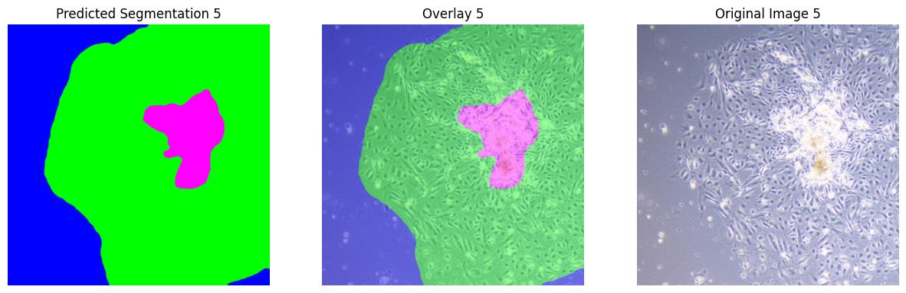
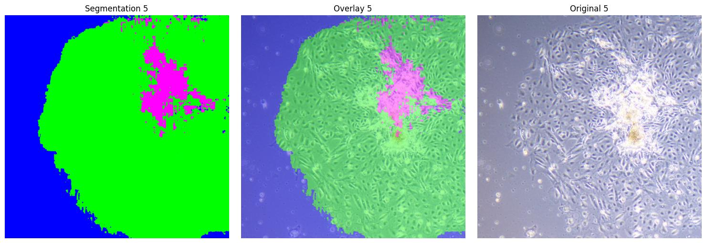

# Semantic Segmentation of iPS Cells at the Single-Pixel Level: Case Study on Model Complexity in Biomedical Imaging

DeepLabv3 sample result 1

SAM2 sample result 1

DeepLabv3 sample result 5

SAM2 sample result 5

## 📌News

[2024.07.01] - Begin based on work of https://doi.org/10.1007/978-3-030-87735-4_4.  

## ⏰TODOs
- [ ] Release the dataset and training code
- [x] Provide publicly accessible result
- [ ] Provide samples of result
- [ ] Release tools for merging weights from community models or LoRAs
- [ ] Release SSAT-benchmark evaluation code
- [ ] Release SSAT training code
>>>>>>> origin/main

## 💡Description

